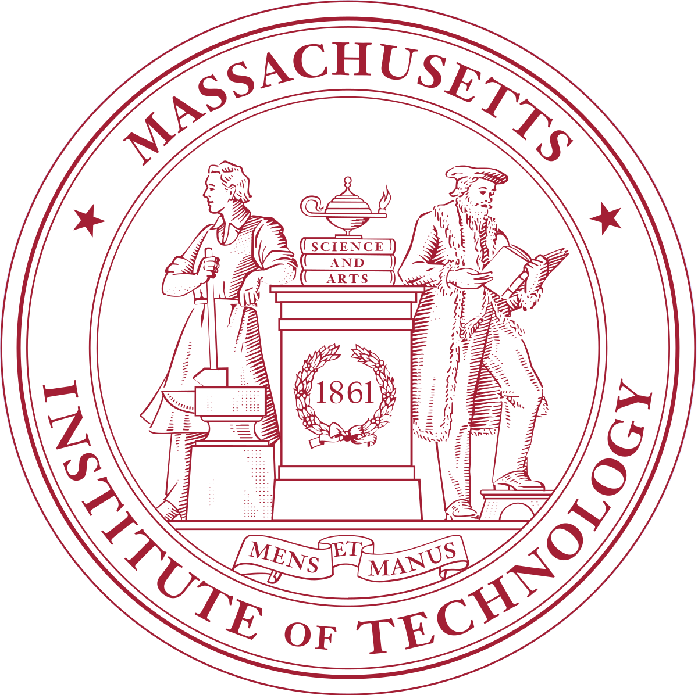

<!-- 

 -->

I am Chunru Lin (林春茹), a first-year Ph.D. student in [UMass Amherts](https://www.umass.edu/), advised by Prof. [Chuang Gan](https://people.csail.mit.edu/ganchuang/). Previously, I completed my B.S. in Computer Science and Technology from [ACM Honor Class](https://acm.sjtu.edu.cn/home), [Shanghai Jiao Tong University](https://en.sjtu.edu.cn/). My research interest lies in **Robotics**, **Computer Vision** and **Artificial Intelligence**. 

## Education

&emsp; [University of Massachusetts Amherst](https://www.umass.edu/)  
&emsp; Ph.D. student in Computer Science, advised by Prof. Chuang Gan. Sep. 2023 - Present

&emsp; [Shanghai Jiao Tong University](http://en.sjtu.edu.cn/)  
&emsp; B.Eng. in Computer Science. Sep. 2019 - June 2023

## Research Experience

&emsp; [Shanghai Qi Zhi Institute](https://sqz.ac.cn/en)  
&emsp; Research Intern, advised by Prof. [Tao Du](https://people.iiis.tsinghua.edu.cn/~taodu/). Mar. 2023 - Sept. 2023

&emsp; [Massachusetts Institution of Technology](https://www.mit.edu/)  
&emsp; Visiting Student Researcher at [CoCoSci Lab](https://cocosci.mit.edu/), advised by Prof. [Josh Tenenbaum](http://web.mit.edu/cocosci/josh.html) and [Chuang Gan](https://people.csail.mit.edu/ganchuang/). Mar. 2022 - Present

&emsp; [Shanghai Jiao Tong University](http://en.sjtu.edu.cn/)  
&emsp; Undergraduate Researcher at [BCMI Lab](https://bcmi.sjtu.edu.cn/), advised by Prof. [Li Niu](http://www.ustcnewly.com/). Sept. 2021 - Mar. 2022

## Publications

- **3D Concept Learning and Reasoning from Multi-View Images**

  Yining Hong, **Chunru Lin**, Yilun Du, Zhenfang Chen, Joshua B. Tenenbaum, Chuang Gan

  CVPR 2023 [[Project](https://vis-www.cs.umass.edu/3d-clr/)] [[Paper](https://arxiv.org/abs/2303.11327)] [[Code](https://github.com/evelinehong/3D-CLR-Official)]

- **3D Concept Grounding on Neural Fields**

  Yining Hong, Yilun Du, **Chunru Lin**, Joshua B. Tenenbaum, Chuang Gan

  Neurips 2022 [[Paper](https://arxiv.org/abs/2207.06403)] [[Code](https://github.com/evelinehong/3D-Concept-Grounding)]

- **DiffVL: Scaling Up Soft Body Manipulation using Vision-Language Driven Differentiable Physics**

  Zhiao Huang, Feng Chen, Yewen Pu, **Chunru Lin**, Hao Su, Chuang Gan

  Neurips 2023 [[Paper](https://arxiv.org/abs/2312.06408)]